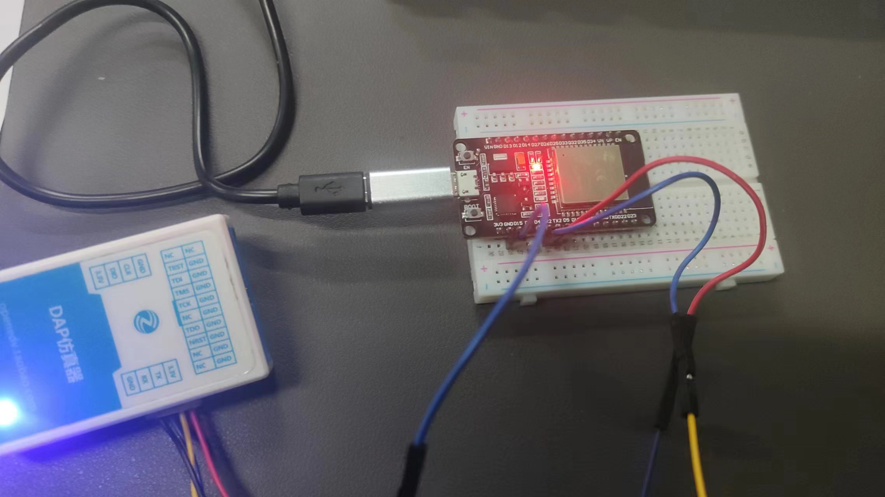

### 说明：

1. 本文档由DuRuofu撰写，由DuRuofu负责解释及执行。
2. 本文档介绍ESP32外设-UART的基本使用

### 修订历史：

|  文档名称  |  版本  |  作者  |      时间      |   备注   |
| ---- | ---- | ------------ | ------ |
| ESP32外设-UART入门 |v1.0.0| DuRuofu | 2024-03-03 | 首次建立 |

<div STYLE="page-break-after: always;"></div>

# ESP32外设-UART入门

## 一、UART介绍

通用异步接收器/发送器 (UART) 属于一种硬件功能，通过使用 RS232、RS422、RS485 等常见异步串行通信接口来处理通信时序要求和数据帧。UART 是实现不同设备之间全双工或半双工数据交换的一种常用且经济的方式。

ESP32 芯片有 3 个 UART 控制器（也称为端口），每个控制器都有一组相同的寄存器以简化编程并提高灵活性。

每个 UART 控制器可以独立配置波特率、数据位长度、位顺序、停止位位数、奇偶校验位等参数。所有具备完整功能的 UART 控制器都能与不同制造商的 UART 设备兼容，并且支持红外数据协会 (IrDA) 定义的标准协议。


## 二、功能概述

基本编程流程分为以下几个步骤：

1. [设置通信参数](https://docs.espressif.com/projects/esp-idf/zh_CN/latest/esp32/api-reference/peripherals/uart.html#uart-api-setting-communication-parameters) - 设置波特率、数据位、停止位等
2. [设置通信管脚](https://docs.espressif.com/projects/esp-idf/zh_CN/latest/esp32/api-reference/peripherals/uart.html#uart-api-setting-communication-pins) - 分配连接设备的管脚
3. [安装驱动程序](https://docs.espressif.com/projects/esp-idf/zh_CN/latest/esp32/api-reference/peripherals/uart.html#uart-api-driver-installation) - 为 UART 驱动程序分配 ESP32 资源
4. [运行 UART 通信](https://docs.espressif.com/projects/esp-idf/zh_CN/latest/esp32/api-reference/peripherals/uart.html#uart-api-running-uart-communication) - 发送/接收数据
5. [使用中断](https://docs.espressif.com/projects/esp-idf/zh_CN/latest/esp32/api-reference/peripherals/uart.html#uart-api-using-interrupts) - 触发特定通信事件的中断
6. [删除驱动程序](https://docs.espressif.com/projects/esp-idf/zh_CN/latest/esp32/api-reference/peripherals/uart.html#uart-api-deleting-driver) - 如无需 UART 通信，则释放已分配的资源
   
>步骤 1 到 3 为配置阶段，步骤 4 为 UART 运行阶段，步骤 5 和 6 为可选步骤。
>UART 驱动程序函数通过 [`uart_port_t`](https://docs.espressif.com/projects/esp-idf/zh_CN/latest/esp32/api-reference/peripherals/uart.html#_CPPv411uart_port_t "uart_port_t") 识别不同的 UART 控制器。调用以下所有函数均需此标识。


## 三、UART简单使用

### 1、设置通信参数

#### 结构体配置：
调用函数 [`uart_param_config()`](https://docs.espressif.com/projects/esp-idf/zh_CN/latest/esp32/api-reference/peripherals/uart.html#_CPPv417uart_param_config11uart_port_tPK13uart_config_t "uart_param_config") 并向其传递 [`uart_config_t`](https://docs.espressif.com/projects/esp-idf/zh_CN/latest/esp32/api-reference/peripherals/uart.html#_CPPv413uart_config_t "uart_config_t") 结构体，[`uart_config_t`](https://docs.espressif.com/projects/esp-idf/zh_CN/latest/esp32/api-reference/peripherals/uart.html#_CPPv413uart_config_t "uart_config_t") 结构体应包含所有必要的参数。

``` c
// 定义使用的UART端口为UART_NUM_2，即第三个UART端口
const uart_port_t uart_num = UART_NUM_2;

// 初始化并配置UART的参数
uart_config_t uart_config = {
    .baud_rate = 115200, // 设置波特率为115200，这是数据传输速率的一种度量
    .data_bits = UART_DATA_8_BITS, // 设置数据位为8位，这是每个数据包中的位数
    .parity = UART_PARITY_DISABLE, // 禁用奇偶校验，用于错误检测
    .stop_bits = UART_STOP_BITS_1, // 设置停止位为1，停止位用于标识每个数据包的结束
    .flow_ctrl = UART_HW_FLOWCTRL_CTS_RTS, // 启用CTS/RTS硬件流控制，用于调节数据传输速率，防止数据丢失
    .rx_flow_ctrl_thresh = 122, // 设置接收流控制阈值为122，这与硬件流控制相关
};

// 使用上述配置参数配置UART端口
// ESP_ERROR_CHECK是一个宏，用于检查函数返回的错误码，并在出错时终止程序
ESP_ERROR_CHECK(uart_param_config(uart_num, &uart_config));

```
#### 函数分步配置：

调用下表中的专用函数，能够单独配置特定参数。如需重新配置某个参数，也可使用这些函数

|配置参数|函数|
|---|---|
|波特率|[`uart_set_baudrate()`](https://docs.espressif.com/projects/esp-idf/zh_CN/latest/esp32/api-reference/peripherals/uart.html#_CPPv417uart_set_baudrate11uart_port_t8uint32_t "uart_set_baudrate")|
|传输位|调用 [`uart_set_word_length()`](https://docs.espressif.com/projects/esp-idf/zh_CN/latest/esp32/api-reference/peripherals/uart.html#_CPPv420uart_set_word_length11uart_port_t18uart_word_length_t "uart_set_word_length") 设置 [`uart_word_length_t`](https://docs.espressif.com/projects/esp-idf/zh_CN/latest/esp32/api-reference/peripherals/uart.html#_CPPv418uart_word_length_t "uart_word_length_t")|
|奇偶控制|调用 [`uart_parity_t`](https://docs.espressif.com/projects/esp-idf/zh_CN/latest/esp32/api-reference/peripherals/uart.html#_CPPv413uart_parity_t "uart_parity_t") 设置 [`uart_set_parity()`](https://docs.espressif.com/projects/esp-idf/zh_CN/latest/esp32/api-reference/peripherals/uart.html#_CPPv415uart_set_parity11uart_port_t13uart_parity_t "uart_set_parity")|
|停止位|调用 [`uart_set_stop_bits()`](https://docs.espressif.com/projects/esp-idf/zh_CN/latest/esp32/api-reference/peripherals/uart.html#_CPPv418uart_set_stop_bits11uart_port_t16uart_stop_bits_t "uart_set_stop_bits") 设置 [`uart_stop_bits_t`](https://docs.espressif.com/projects/esp-idf/zh_CN/latest/esp32/api-reference/peripherals/uart.html#_CPPv416uart_stop_bits_t "uart_stop_bits_t")|
|硬件流控模式|调用 [`uart_set_hw_flow_ctrl()`](https://docs.espressif.com/projects/esp-idf/zh_CN/latest/esp32/api-reference/peripherals/uart.html#_CPPv421uart_set_hw_flow_ctrl11uart_port_t21uart_hw_flowcontrol_t7uint8_t "uart_set_hw_flow_ctrl") 设置 [`uart_hw_flowcontrol_t`](https://docs.espressif.com/projects/esp-idf/zh_CN/latest/esp32/api-reference/peripherals/uart.html#_CPPv421uart_hw_flowcontrol_t "uart_hw_flowcontrol_t")|
|通信模式|调用 [`uart_set_mode()`](https://docs.espressif.com/projects/esp-idf/zh_CN/latest/esp32/api-reference/peripherals/uart.html#_CPPv413uart_set_mode11uart_port_t11uart_mode_t "uart_set_mode") 设置 [`uart_mode_t`](https://docs.espressif.com/projects/esp-idf/zh_CN/latest/esp32/api-reference/peripherals/uart.html#_CPPv411uart_mode_t "uart_mode_t")|
表中每个函数都可使用 `_get_` 对应项来查看当前设置值。例如，查看当前波特率值，调用 [`uart_get_baudrate()`](https://docs.espressif.com/projects/esp-idf/zh_CN/latest/esp32/api-reference/peripherals/uart.html#_CPPv417uart_get_baudrate11uart_port_tP8uint32_t "uart_get_baudrate")。

### 2、分配引脚

通信参数设置完成后，可以配置其他 UART 设备连接的 GPIO 管脚。调用函数 [`uart_set_pin()`](https://docs.espressif.com/projects/esp-idf/zh_CN/latest/esp32/api-reference/peripherals/uart.html#_CPPv412uart_set_pin11uart_port_tiiii "uart_set_pin")，指定配置 Tx、Rx、RTS 和 CTS 信号的 GPIO 管脚编号。如要为特定信号保留当前分配的管脚编号，可传递宏 [`UART_PIN_NO_CHANGE`](https://docs.espressif.com/projects/esp-idf/zh_CN/latest/esp32/api-reference/peripherals/uart.html#c.UART_PIN_NO_CHANGE "UART_PIN_NO_CHANGE")。

```c
// Set UART pins(TX: IO4, RX: IO5, RTS: IO18, CTS: IO19)
ESP_ERROR_CHECK(uart_set_pin(UART_NUM_2, 4, 5, 18, 19));
```

### 3、安装驱动程序

通信管脚设置完成后，请调用 [`uart_driver_install()`](https://docs.espressif.com/projects/esp-idf/zh_CN/latest/esp32/api-reference/peripherals/uart.html#_CPPv419uart_driver_install11uart_port_tiiiP13QueueHandle_ti "uart_driver_install") 安装驱动程序并指定以下参数：
- Tx 环形缓冲区的大小
- Rx 环形缓冲区的大小
- 事件队列句柄和大小
- 分配中断的标志
该函数将为 UART 驱动程序分配所需的内部资源。
```c

// Setup UART buffered IO with event queue
const int uart_buffer_size = (1024 * 2);
QueueHandle_t uart_queue;
// Install UART driver using an event queue here
ESP_ERROR_CHECK(uart_driver_install(UART_NUM_2, uart_buffer_size, \
                                        uart_buffer_size, 10, &uart_queue, 0));

```

此步骤完成后，可连接外部 UART 设备检查通信。

>注意：当TX 缓冲区参数填 0 或 NULL 的时候，不使用缓冲区，使用uart_write_bytes()发送操作时，在数据发送之前将会阻塞。
>
>同样也有不阻塞的函数uart_tx_chars()，它不会为等待TX FIFO有足够的空间而阻塞，而是将填充可用的TX FIFO。此函数返回时，FIFO是满的。

示例：
``` c
QueueHandle_t eventQueue;

uart_driver_install(
	UART_NUM_2, 	//UART 编号
	sizeof rxBuf, 	//Rx 缓冲区大小
	sizeof rxBuf, 	//Tx 缓冲区大小
	16, 			//事件队列长度（可以不要，此参数填 0，然后下一个参数填NULL）
	&eventQueue, 	//(QueueHandle_t*)接受被创建的句柄的变量指针，类型为FreeRTOS的队列
	0				//中断分配标志，这里写 0 表示不想分配中断
);

uart_set_pin(
	UART_NUM_2, 	//UART 编号
	19, 			//TX GPIO
	18, 			//RX GPIO
	5, 				//RTS GPIO
	4				//CTS GPIO
);

```

### 3、收发数据

使用函数`uart_write_bytes()` 和 `uart_read_bytes()` 分别进行发送数据以及接收数据。**两个函数的参数均为（UART_NUM，发送内容首地址/接受缓冲区地址，长度）**

下面是一个简单的UART通信示例，展示如何使用ESP32进行数据的发送和接收。
``` c
#include "freertos/FreeRTOS.h"
#include "freertos/task.h"
#include "freertos/queue.h"
#include "driver/uart.h"
#include "esp_err.h"
#include "string.h"

#define TX_GPIO_NUM 17
#define RX_GPIO_NUM 16

// 配置串口3
void uart_config(void) {
    const uart_port_t uart_num = UART_NUM_2;

    uart_config_t uart_config = {
        .baud_rate = 115200,
        .data_bits = UART_DATA_8_BITS,
        .parity = UART_PARITY_DISABLE,
        .stop_bits = UART_STOP_BITS_1,
        .flow_ctrl = UART_HW_FLOWCTRL_DISABLE,
        .rx_flow_ctrl_thresh = 122,
    };

    // 配置UART参数
    ESP_ERROR_CHECK(uart_param_config(uart_num, &uart_config));

    // 设置UART引脚
    ESP_ERROR_CHECK(uart_set_pin(uart_num, TX_GPIO_NUM, RX_GPIO_NUM, UART_PIN_NO_CHANGE, UART_PIN_NO_CHANGE));

    // 安装UART驱动程序，不使用事件队列
    const int uart_buffer_size = (1024 * 2);
    ESP_ERROR_CHECK(uart_driver_install(uart_num, uart_buffer_size, 0, 0, NULL, 0));
}

// 串口发送测试
void uart_send_receive_demo(void) {
    const uart_port_t uart_num = UART_NUM_2;
    char* test_str = "This is a UART test string.\n";
    uint8_t data[128];

    // 发送数据
    uart_write_bytes(uart_num, test_str, strlen(test_str));

    while(1){
        vTaskDelay(1);
        // 等待数据接收
        int length = 0;
        ESP_ERROR_CHECK(uart_get_buffered_data_len(uart_num, (size_t*)&length));
        if(length > 0) {
            int read_len = uart_read_bytes(uart_num, data, length, pdMS_TO_TICKS(1000));
            if(read_len > 0) {
                // 输出接收到的数据
                printf("Received: %.*s\n", read_len, data);
            }
        }
    }

}


void app_main(void) {
    uart_config();
    uart_send_receive_demo();
}

```

连接硬件：



测试接收发送效果：

发送：


接收：


# 参考链接

1. https://blog.csdn.net/m0_50064262/article/details/119006749
2. https://docs.espressif.com/projects/esp-idf/zh_CN/latest/esp32/api-reference/peripherals/uart.html#uart-api-setting-communication-parameters